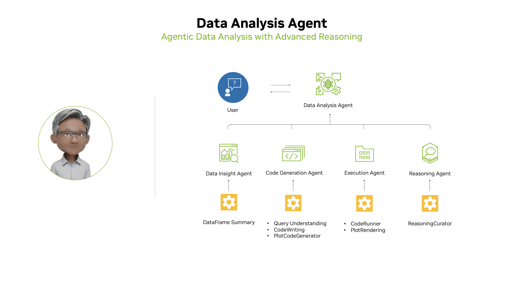
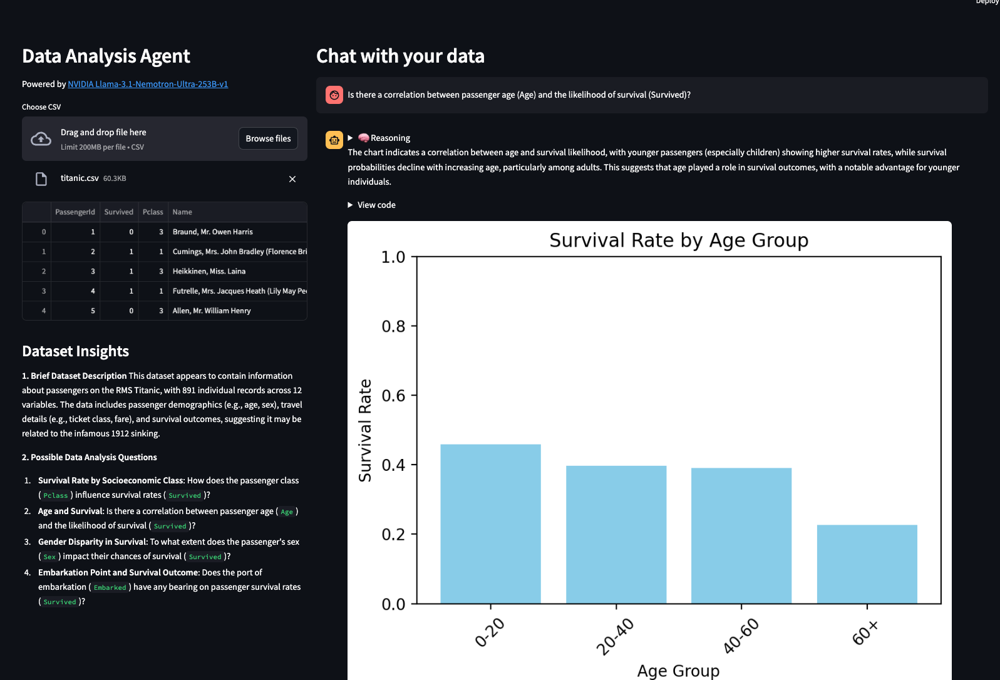

# Data Analysis Agent

An interactive, agentic data analysis application that leverages advanced LLM reasoning to help users explore, visualize, and understand their data using NVIDIA Llama-3.1-Nemotron-Ultra-253B-v1 and NVIDIA Llama-3.3-Nemotron-Super-49B-v1.5.

## Overview

This repository contains a Streamlit application that demonstrates a complete workflow for data analysis:
1. **Data Upload**: Upload CSV files for analysis
2. **Natural Language Queries**: Ask questions about your data in plain English
3. **Automated Visualization**: Generate relevant plots and charts
4. **Transparent Reasoning**: Get detailed explanations of the analysis process

The implementation leverages the powerful Llama-3.1-Nemotron-Ultra-253B-v1 and Llama-3.3-Nemotron-Super-49B-v1.5 models through NVIDIA's API, enabling sophisticated data analysis and reasoning.

Learn more about the models [here](https://developer.nvidia.com/blog/build-enterprise-ai-agents-with-advanced-open-nvidia-llama-nemotron-reasoning-models/).

## Features

- **Agentic Architecture**: Modular agents for data insight, code generation, execution, and reasoning
- **Natural Language Queries**: Ask questions about your data—no coding required
- **Automated Visualization**: Instantly generate and display relevant plots
- **Transparent Reasoning**: Get clear, LLM-generated explanations for every result
- **Powered by NVIDIA Llama-3.1-Nemotron-Ultra-253B-v1 and NVIDIA Llama-3.3-Nemotron-Super-49B-v1.5**: State-of-the-art reasoning and interpretability



## Requirements

- Python 3.10+
- Streamlit
- NVIDIA API Key (see [Installation](#installation) section for setup instructions)
- Required Python packages:
  - pandas
  - matplotlib
  - streamlit
  - requests

## Installation

1. Clone this repository:
   ```bash
   git clone https://github.com/NVIDIA/GenerativeAIExamples.git
   cd RAG/data-analysis-agent
   ```

2. Create a Python virtual environment and activate it:

   > **Note:** Use Python 3.11 or 3.12. Python 3.13+ may cause hard crashes with some native packages.
   > If needed, install a compatible version first:
   > - **macOS:** `brew install python@3.11`
   > - **Ubuntu/Debian:** `sudo apt install python3.11`
   > - **Fedora/RHEL:** `sudo dnf install python3.11`

   ```console
   python3.11 -m venv genai_data
   source genai_data/bin/activate
   ```

3. Install dependencies:
   ```console
   pip install --upgrade pip
   pip install -r requirements.txt
   ```

4. Set up your NVIDIA API key:
   - Sign up or log in at [NVIDIA Build](https://build.nvidia.com/nvidia/llama-3_1-nemotron-ultra-253b-v1?integrate_nim=true&hosted_api=true&modal=integrate-nim)
   - Generate an API key
   - Set the API key in your environment:
     ```bash
     export NVIDIA_API_KEY="nvapi-*"
     ```
   - Or add it to your `.env` file if you use one

## Usage

1. Run the Streamlit app:
   ```bash
   streamlit run data_analysis_agent.py
   ```

   > **macOS note:** If you get `OMP: Error #15` (duplicate OpenMP runtime), set this variable before running:
   > ```console
   > export KMP_DUPLICATE_LIB_OK=TRUE
   > streamlit run data_analysis_agent.py
   > ```

2. Download example dataset (optional):
   ```bash
   wget https://raw.githubusercontent.com/datasciencedojo/datasets/master/titanic.csv
   ```

3. Use the application:
   - Select a model from the dropdown menu
   - Upload a CSV file (e.g., the Titanic dataset)
   - Ask questions in natural language
   - View results, visualizations, and detailed reasoning

## Example



## Models Details

The Llama-3.1-Nemotron-Ultra-253B-v1 model used in this project has the following specifications:
- **Parameters**: 253B
- **Features**: Advanced reasoning capabilities
- **Use Cases**: Complex data analysis, multi-agent systems
- **Enterprise Ready**: Optimized for production deployment

The Llama-3.3-Nemotron-Super-49B-v1.5 model used in this project has the following specifications:
- **Parameters**: 49B
- **Features**: Efficient reasoning and and chat model
- **Use Cases**: AI Agent systems, chatbots, RAG systems, and other AI-powered applications. Also suitable for typical instruction-following tasks
- **Enterprise Ready**: Optimized for production deployment


### [More examples ](https://github.com/NVIDIA/GenerativeAIExamples/tree/main)
